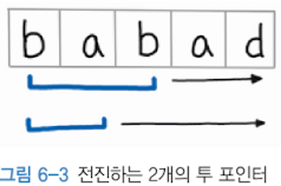

# 06. 가장 긴 팰린드롬 부분 문자열

가장 긴 팰린드롬 부분 문자열을 출력하라.

- input
  - "babad"


- output
  - "bab" or "aba"

---

- input
  - "cbbd"


- output
  - "bb"

## 풀이

1. 중앙을 중심으로 확장하는 풀이

```python
def longestPalindrome(s: str) -> str:
    def expend(left: int, right: int) ->str:
    # 팰린드롬 판별 및 포인터 확장
        while left >=0 and right <= len(s)-1 and s[left] == s[right]:
            left -= 1
            right +=1
        return s[left + 1:right - 1]
    #예외 처리를 하여 빠르게 리턴(문자열이 문자 하나만 있거나 문자열 전체가 팰린드롬 일때)    
    if len(s) < 2 or s[:] == s[::-1]:
      return s

    result = ''
    for i in range(len(s) - 1):
        result = max(result, 
                     expend(i, i+1), #짝수일때
                     expend(i, i+2), #홀수일때
                     key=len)
    return result
```

슬라이딩 윈도우 방식을 이용한 풀이이다. 투 포인터가 중앙을 중심으로 확장하는 형태로 팰린드롬이 판별이 되면 중앙을 중심으로 투 포인터를 양쪽으로 한칸 씩 확장해 나가면서 가장 긴 팰린드롬을 찾는 형태이다.
이 문제에서는 짝수일때와 홀수일때 중앙을 지정방식이 다르므로 2개의 투 포인터를 사용하여 짝수와 홀수일때 모두 판별하도록 하였다. 



홀수인 경우 expend(i, i+2) 방식으로 3칸으로 구성된 투 포인터가 앞으로 전진하고
짝수인 경우 expend(i, i+1) 방식으로 2칸으로 구성된 투 포인터가 앞으로 전진하면서 팰린드롬을 판별한다. 


투 포인터가 양쪽을 비교해 같다면 팰린드롬이 아닐때까지 포인터를 확장시켜 가장 긴 팰린드롬을 판별하게 한다.