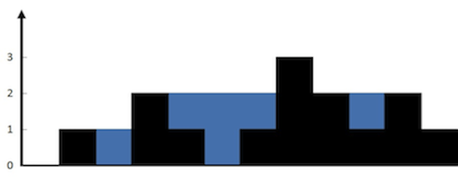

# 08. 빗물 트래핑

높이를 입력받아 비 온 후 얼마나 많은 물이 쌓일 수 있는지 계산하라

- input
  - [0, 1, 0, 2, 1, 0, 1, 3, 2, 1, 2, 1]


- output 
  - 6



## 풀이

1. 투 포인터를 최대로 이동

```python
def trap(self, height: List[int]) -> int:
	if not height:
		return 0
	
	volume = 0
	left, right = 0, len(height) - 1
	left_max, right_max = height[left], height[right]

	while left<right:
		left_max, right_max = max(height[left], left_max),
													max(height[right], right_max)
		if left_max <= right_max:
			volume += left_max - height[left]
			left += 1
		else:
			volume += right_max - height[right]
			right -= 1
 return volume
```

투포인터가 각각 최대 높이 막대 까지 이동하면서 물의 양을 구해서 더하는 방식이다. 
최대 높이의 막대까지 각각 좌우 기둥 최대 높이 left_max, right_max가 현재 높이와의 차이만큼 물 높이 volume을 더해 나간다.

이 경우 적어도 낮은 쪽은 그만큼 항상 채워질 것이기 때문에, 좌우 어느 쯕이든 낮은 쪽은 높은 쪽을 향해서 포인터가 가운데로 점점 이동한다. 막대가 최대인 지점에서 두 포인터가 서로 만나게 되며 O(n)에 풀이가 가능하다.

2. 스택 쌓기

```python
def trap(self, height):
	stack = []
	volum = 0
	
	for i in range(len(height)):
		while stack and height[i] > height[stack[-1]]:
			top = stack.pop()
				
			if not len(stack):
				break
			distance = i - stack[-1] - 1
			waters = min(height[i], height[stack[-1]]) - height[top]
			
			volum += distance * waters
	
		stack.append(i)
	return volum
```